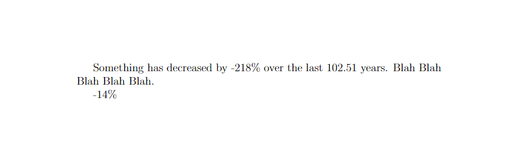

<!-- README.md is generated from README.Rmd. Please edit that file -->

# savetexvalue

<!-- badges: start -->
<!-- badges: end -->

`savetexvalue` helps saving and managing values calculated in R for
integration in projects written in LaTeX in an automatic and
reproducible way. savetexvalue uses special formatted `.tex` files
containing pairs of values and command names to be used in LaTeX.

## Installation

You can install the development version of savetexvalue from
[GitHub](https://github.com/) with:

``` r
# install.packages("devtools")
devtools::install_github("Ori-Shoham/savetexvalue")
```

## Usage and examples

This is a basic example which shows you how to solve a common problem:

``` r
library(savetexvalue)
data(iris)
## basic example code
test_file_1 <- paste0(tempfile(),".tex")
withr::local_file(save_tex_value(value = 1:26, name = letters, file_name = "iris"))
print_tex_value(file_name = "iris", path = NULL, names = c("a","b","f"))
#>    name value
#> 1:    a  1.00
#> 2:    b  2.00
#> 3:    f  6.00
```



What is special about using `README.Rmd` instead of just `README.md`?
You can include R chunks like so:

``` r
summary(cars)
#>      speed           dist       
#>  Min.   : 4.0   Min.   :  2.00  
#>  1st Qu.:12.0   1st Qu.: 26.00  
#>  Median :15.0   Median : 36.00  
#>  Mean   :15.4   Mean   : 42.98  
#>  3rd Qu.:19.0   3rd Qu.: 56.00  
#>  Max.   :25.0   Max.   :120.00
```

You’ll still need to render `README.Rmd` regularly, to keep `README.md`
up-to-date. `devtools::build_readme()` is handy for this. You could also
use GitHub Actions to re-render `README.Rmd` every time you push. An
example workflow can be found here:
<https://github.com/r-lib/actions/tree/v1/examples>.

You can also embed plots, for example:


In that case, don’t forget to commit and push the resulting figure
files, so they display on GitHub and CRAN.
