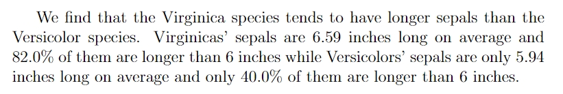

<!-- README.md is generated from README.Rmd. Please edit that file -->

# savetexvalue

<!-- badges: start -->
<!-- badges: end -->

savetexvalue helps saving and managing values calculated in R for
integration in projects written in LaTeX in an automatic and
reproducible way. savetexvalue uses special formatted `.tex` files
containing pairs of values and command names to be used in LaTeX.

## Installation

You can install savetexvalue from [GitHub](https://github.com/) with:

``` r
# install.packages("devtools")
devtools::install_github("Ori-Shoham/savetexvalue")
```

## Example

Suppose you work on a project analyzing the sepal length of irises.

``` r
library(savetexvalue)
library(dplyr)
#> 
#> Attaching package: 'dplyr'
#> The following objects are masked from 'package:stats':
#> 
#>     filter, lag
#> The following objects are masked from 'package:base':
#> 
#>     intersect, setdiff, setequal, union
data(iris)

# These are the computations
avg_sep_length <- iris %>% 
  group_by(Species) %>% 
  summarise(sep_length_avg = mean(Sepal.Length))

prop_greater_6 <- iris %>% 
  group_by(Species) %>% 
  summarise(prop_greater = mean(Sepal.Length > 6))

# Save the values:
path <-tempdir()
save_tex_value(values = avg_sep_length$sep_length_avg,
               names = paste0(avg_sep_length$Species,"Avg"),
               file_name = "iris_calc",
               path = path)
save_tex_value(values = prop_greater_6$prop_greater,
               names = paste0(prop_greater_6$Species,"PerGreaterSix"),
               file_name = "iris_calc",
               path = path,
               percent = T,
               accuracy = 0.1)
```

The contents of `iris_calc.tex` should now be:

    \newcommand\setosaAvg {5.01}
    \newcommand\setosaPerGreaterSix {0.0\%}
    \newcommand\versicolorAvg {5.94}
    \newcommand\versicolorPerGreaterSix {40.0\%}
    \newcommand\virginicaAvg {6.59}
    \newcommand\virginicaPerGreaterSix {82.0\%}

The values are ready to be used in your paper! The `.tex` file for your
paper could look like this:

    \documentclass{article}
    \begin{document}

    \input{iris_calc}
    We find that the Virginica species tends to have longer sepals than the Versicolor species. Virginicas' sepals are \virginicaAvg{} inches long on average and \virginicaPerGreaterSix{} of them are longer than 6 inches while Versicolors' sepals are only \versicolorAvg{} inches long on average and only \versicolorPerGreaterSix{} of them are longer than 6 inches.

    \end{document}

And after compiling to `.pdf` would look like this:


